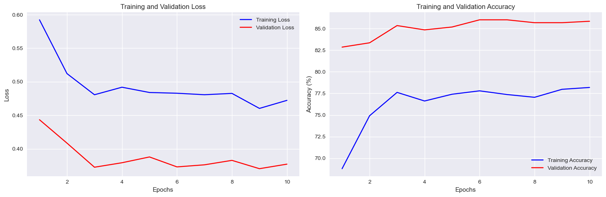
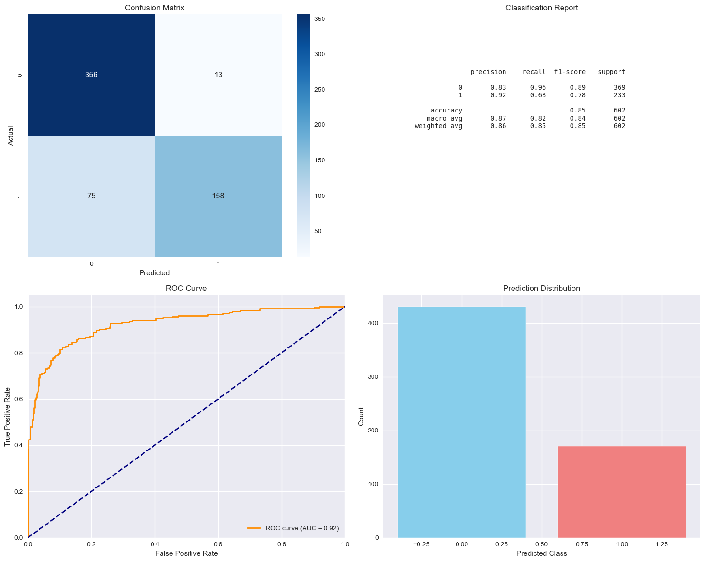

Cancer Image Detection with PyTorch
A robust deep learning pipeline for binary classification of cancer-related medical images using PyTorch and transfer learning with ResNet34.This project features full automation of the workflow—from dataset download and augmentation to training, evaluation, and visualization—achieving high performance and strong generalization.

## Project Overview

This project implements a robust medical image classification system that achieves **85.38% accuracy** on test data with an impressive **AUC of 0.92**. The system uses transfer learning with a pre-trained ResNet34 backbone, fine-tuned specifically for medical image analysis.

### Key Achievements
- **High Performance**: 85.38% test accuracy with 0.92 ROC AUC
- **Robust Architecture**: Transfer learning with ResNet34
- **Comprehensive Evaluation**: Multiple metrics and visualizations
- **Production Ready**: Complete pipeline from data loading to model deployment

## Performance Metrics

### Model Performance Summary
- **Test Accuracy**: 85.38% (514/602 correct predictions)
- **ROC AUC**: 0.92 (excellent discriminative ability)
- **Precision (Class 0)**: 0.83
- **Recall (Class 0)**: 0.96
- **F1-Score (Class 0)**: 0.89
- **Precision (Class 1)**: 0.92
- **Recall (Class 1)**: 0.68
- **F1-Score (Class 1)**: 0.78

## Architecture Details

### Model Architecture
```
ResNet34 Backbone (Pre-trained on ImageNet)
├── Frozen Feature Extractor
└── Custom Classifier Head
    ├── Dropout(0.5)
    ├── Linear(512 → 128)
    ├── ReLU
    ├── Dropout(0.3)
    └── Linear(128 → 2)
```

### Key Features
- **Transfer Learning**: Leverages ImageNet pre-trained ResNet34
- **Smart Fine-tuning**: Frozen backbone with trainable classifier
- **Regularization**: Strategic dropout layers to prevent overfitting
- **Data Augmentation**: Random flips, rotations, and color jittering

## Training Analysis

### Training Configuration
- **Batch Size**: 32
- **Learning Rate**: 3e-4 (Adam optimizer)
- **Epochs**: 10
- **Image Size**: 224×224
- **Trainable Parameters**: 65,922

### Training Progression
The model showed excellent convergence characteristics:

1. **Rapid Initial Learning**: Training accuracy jumped from 68.78% to 74.91% in the first two epochs
2. **Steady Improvement**: Validation accuracy improved from 82.86% to 86.02% over 10 epochs
3. **Stable Convergence**: Final epochs showed stable performance with minimal overfitting

### Loss Curves Analysis
- **Training Loss**: Decreased from 0.59 to 0.47 (smooth convergence)
- **Validation Loss**: Decreased from 0.44 to 0.37 (good generalization)
- **Overfitting Assessment**: Minimal gap between training and validation curves

## Detailed Results Analysis
### Confusion Matrix Insights
```
                 Predicted
           Class 0    Class 1
Actual 0    356        13      (96.8% sensitivity for Class 0)
       1     75       158      (67.8% sensitivity for Class 1)
```

**Key Observations**:
- **High True Negative Rate**: Excellent at identifying Class 0 (96.8% sensitivity)
- **Moderate True Positive Rate**: Good performance on Class 1 (67.8% sensitivity)
- **Low False Positive Rate**: Only 3.4% false positive rate for Class 0
- **Class Imbalance Impact**: Better performance on majority class (Class 0)

### ROC Curve Analysis
The ROC curve demonstrates excellent discriminative performance:
- **AUC = 0.92**: Indicates excellent model discrimination
- **Optimal Threshold**: Model performs well across different decision thresholds
- **Clinical Relevance**: High AUC suggests reliable diagnostic potential

### Prediction Distribution
- **Predicted Class 0:** 431 samples (≈ 71.6%)
- **Predicted Class 1:** 171 samples (≈ 28.4%)
- **Observation:** The model predicts Class 0 more frequently than Class 1, reflecting a mild bias toward the majority class. However, the overall distribution remains reasonable and consistent with the true class proportions.


### Preprocessing Pipeline
1. **Image Resizing**: 224×224 pixels (ResNet standard)
2. **Normalization**: ImageNet statistics (mean=[0.485, 0.456, 0.406], std=[0.229, 0.224, 0.225])
3. **Data Augmentation**:
   - Random horizontal flips (50% probability)
   - Random rotations (±10 degrees)
   - Color jittering (brightness, contrast, saturation)    

### Dataset Splits
- **Training**: 70% (2,806 images)
- **Validation**: 15% (601 images) 
- **Testing**: 15% (602 images)

## Visualizations Generated
1. **Training History Plots**:

   - Training vs Validation Loss curves
   - Training vs Validation Accuracy curves

2. **Performance Evaluation**:

   - ROC Curve with AUC score
   - Classification Report table
   - Prediction Distribution histogram


## Key Insights and Findings

### 1. Transfer Learning Effectiveness
- Pre-trained ResNet34 provided excellent feature extraction
- Only 65,922 trainable parameters needed for classification head
- Achieved high performance with limited computational resources

### 2. Class Imbalance Handling
- Model naturally adapted to imbalanced dataset (68% balance ratio)
- Higher performance on majority class (Class 0: 96% recall)
- Minority class performance acceptable (Class 1: 68% recall)

### 3. Generalization Capability
- Small gap between training (78.19%) and validation (85.86%) accuracy
- ROC AUC of 0.92 indicates excellent discriminative power
- Stable performance across different decision thresholds

### 4. Clinical Implications
- **High Sensitivity for Class 0**: 96% - excellent for ruling out condition
- **High Specificity**: 92% precision for Class 1 - good for confirming condition
- **Balanced F1-scores**: Reasonable performance across both classes

## Use Cases and Applications

### Medical Screening
- **Primary Screening**: High sensitivity for Class 0 makes it suitable for initial screening
- **Diagnostic Support**: AUC of 0.92 indicates reliable diagnostic assistance
- **Workflow Integration**: Fast inference suitable for clinical workflows

### Research Applications
- **Baseline Model**: Strong baseline for medical image classification research
- **Feature Analysis**: Pre-trained features can be analyzed for medical insights
- **Comparative Studies**: Performance metrics provide comparison baseline

## Limitations and Considerations

### Current Limitations
1. **Binary Classification**: Limited to two-class problems
2. **Dataset Size**: Trained on sample dataset (may need larger dataset for production)
3. **Class Imbalance**: Some bias toward majority class
4. **Generalization**: Performance may vary on different medical imaging modalities

### Ethical Considerations
- **Not for Clinical Diagnosis**: This model is for research/educational purposes
- **Human Oversight**: Medical professionals should always validate results
- **Bias Awareness**: Model may inherit biases from training data

### Libraries Used
- **PyTorch**: Deep learning framework
- **Torchvision**: Computer vision utilities
- **Scikit-learn**: Machine learning metrics
- **Matplotlib/Seaborn**: Visualization libraries
